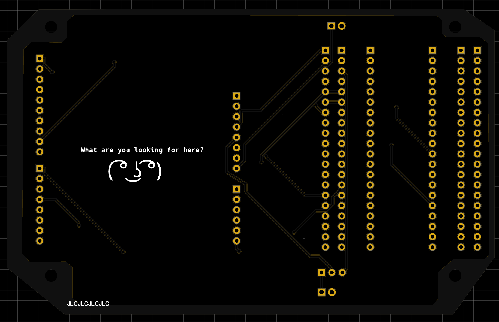

# BlackpillToArduino

One day, i got pretty annoyed by cable management i needed to do in order to get an Arduino shield working with Blackpill board.
So i made a converter board.

**IMPORTANT NOTE: THIS SHIELD IS NOT COMPATIBLE WITH BLUEPILL, BECAUSE IT HAS DIFFERENT PINOUT. IT'S FOR WEACT BLACKPILL ONLY: https://stm32-base.org/boards/STM32F411CEU6-WeAct-Black-Pill-V2.0.html.**

If you'll ask, however, i can make bluepill version of this shield.

## Description - READ FIRST BEFORE COMPLAINING THAT YOUR SHIELD HAS NO POWER

It's pretty simple, it has 2 layers, Blackpill connector and female + male header for easy pin access, and Arduino-compatible male header.
It also has external 5V input - you can select it by shorting the `5V_SELECT` pins - middle pin is 5V for Arduino shield, left pin is Blackpill's 5V, right pin is external 5V. **Arduino 5V pin is floating by default - make sure to select the 5V source, before throwing the board against the wall.**

If the shield needs VIN input, you can supply it using VIN header. It's connected only to the Arduino header. I've never seen any shield that needs it, so i put it for the lulz.

Also, be aware that not all STM32 pins can survive 5V input. Connect responsibly.

## Pictures

### Schematics

### PCB

### 3D View

